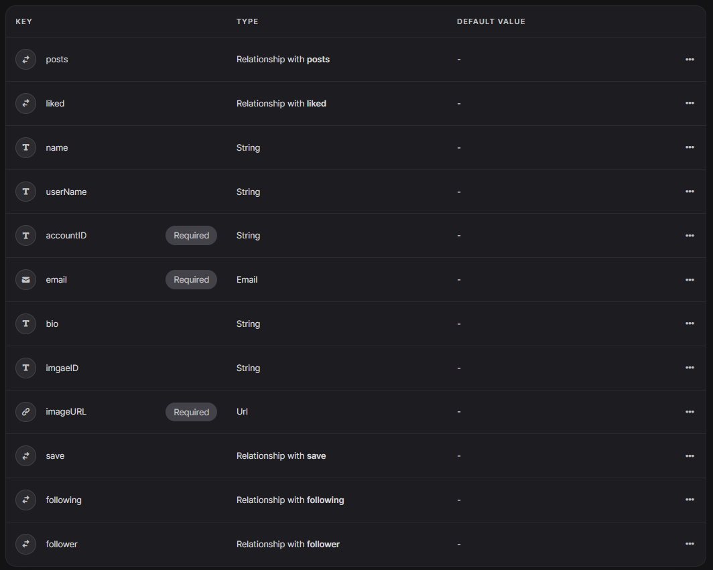
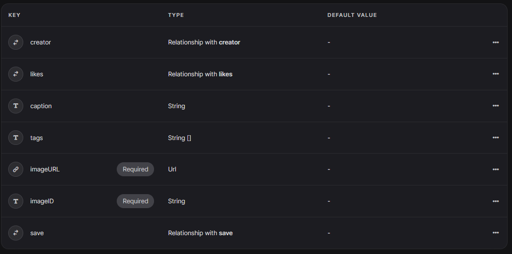
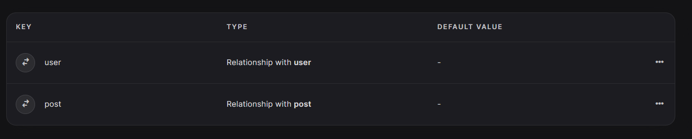
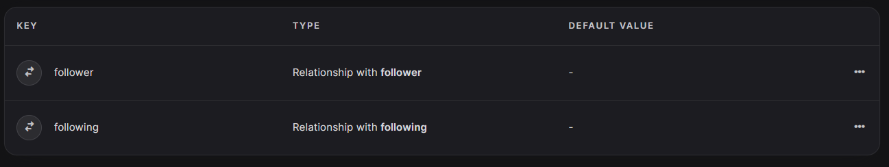
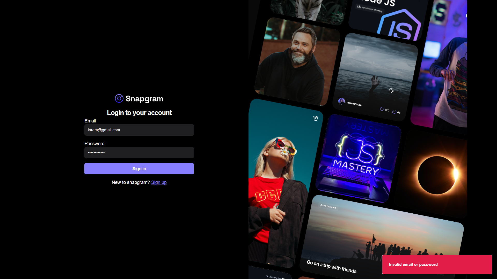
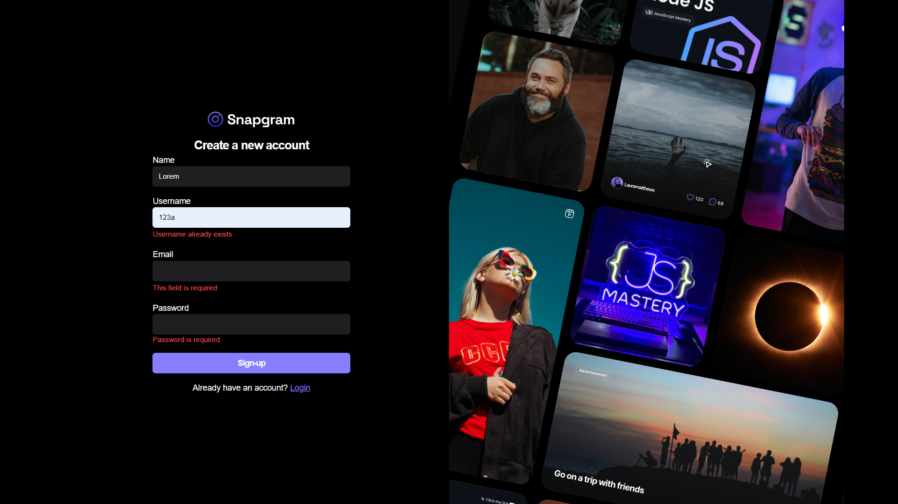
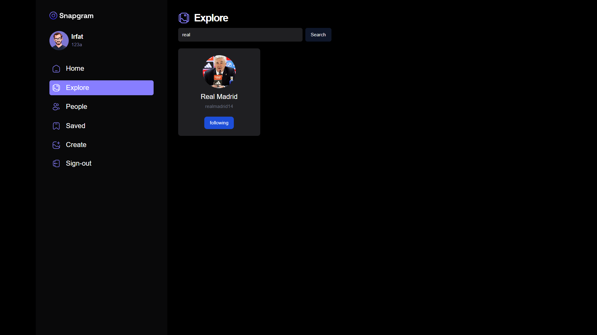
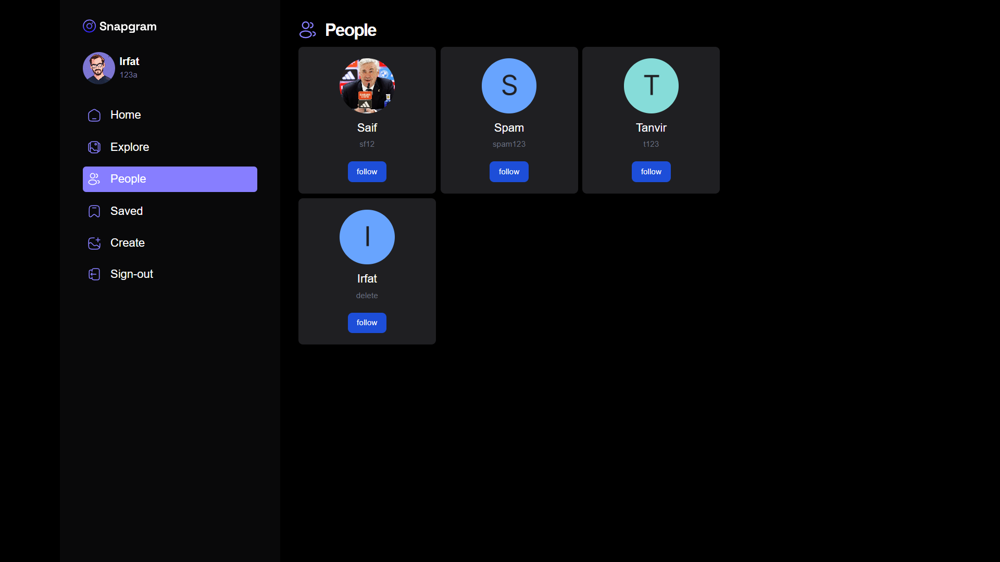
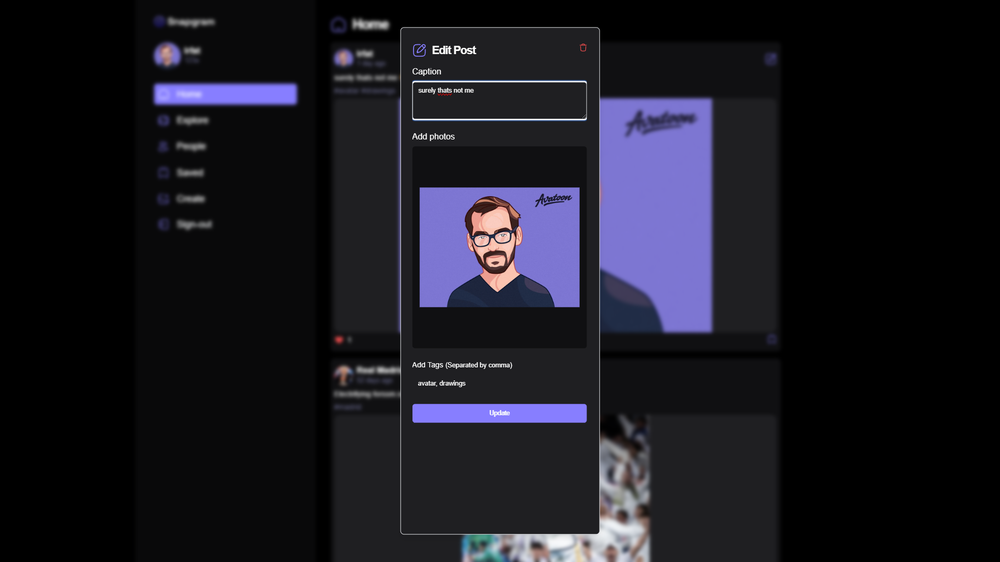

# SnapGram

## Live Demo

Check out the live version of SnapGram: [SnapGram Live Demo](https://snapgram-sage.vercel.app/)

## About

SnapGram is a simple social media platform. User can perform the following operation:

- Login and register to an account
- Post, modify, delete theirs posts
- Follow and unfollow other users
- Save and unsave posts
- Change profile picture

The primary purpose of this project is to:

- **Learn Appwrite:** Gain hands-on experience with Appwrite and understand its features for database, authentication, storage.

- **Improve React Skills:** Enhance proficiency in React and learn best practices for building scalable and maintainable web applications.

- **Explore React Query:** Gain familiarity with React Query and understand its role in managing state and asynchronous data in React applications.

- **Responsive Design:** Being all kinds of device able to show contents.

## Technologies Used

- React.js
- Appwrite
- TypeScript
- Tailwind CSS
- Vite (for development)
- GitHub (version control)

## Limitations

1. **Scalability:**

- The platform may face challenges in scaling to handle a large number of users, posts, and interactions.

2. **Data Privacy:**

- Consideration must be given to user data privacy and compliance with data protection regulations. Clear privacy policies and mechanisms for users to control their data are essential.

3. **Messaging:**

- Implementing features like instant messaging may pose additional challenges.

4. **Content Moderation:**

- A system for content moderation is necessary to prevent inappropriate content, spam, or abusive behavior.

5. **Notification System:**

- Implementing a notification system for users to receive updates on interactions may require careful design and development.

6. **Limited Features:**

- Certain advanced features found in larger social media platforms might be beyond the scope of the current project.

7. **Testing and Quality Assurance:**

- Comprehensive testing and quality assurance processes are crucial to identify and address issues before they reach production.

8. **Hosting and Infrastructure Costs:**

- Depending on the user base and usage patterns, hosting and infrastructure costs may become a consideration, especially as the platform grows.

## Environment Variables

To run this project, you will need to add the following environment variables to your .env.local file

`VITE_APPWRITE_URL`

`VITE_APPWRITE_USER_ID`

`VITE_APPWRITE_STORAGE_ID`

`VITE_APPWRITE_DATABASE_ID`

`VITE_APPWRITE_SAVES_COLLECTION_ID`

`VITE_APPWRITE_POSTS_COLLECTION_ID`

`VITE_APPWRITE_USERS_COLLECTION_ID`

`VITE_APPWRITE_FOLLOW_COLLECTION_ID`

## Setup

1. Create a web project in appwrite.

2. Set the `VITE_APPWRITE_URL` using the api endpoint given by appwrite.

3. Set the `VITE_APPWRITE_USER_ID` using the project id given by appwrite.

4. Create a appwrite storage, database and use the id as `VITE_APPWRITE_STORAGE_ID`, `VITE_APPWRITE_DATABASE_ID`.

5. Create four collection named users, posts, saves, follow having the following properties:

<div style="display: grid; grid-template-columns:repeat(2, 1fr); gap-20px">
  <div>
   <p>Users table:</p>
   
  </div>
  <div>
   <p>Posts table:</p>
   
  </div>
  <div>
   <p>Saves table:</p>
   
  </div>
  <div>
   <p>Follow table:</p>
   
  </div>
</div>

6. use their ids as `VITE_APPWRITE_SAVES_COLLECTION_ID, VITE_APPWRITE_POSTS_COLLECTION_ID, VITE_APPWRITE_USERS_COLLECTION_ID, VITE_APPWRITE_FOLLOW_COLLECTION_ID`.

## Installation

Open cmd and run the following commands one by one

```bash
  git clone https://github.com/Irfat7/SnapGramUI.git
```

```bash
  cd snapgramui
```

```bash
  npm i
```

```bash
  npm run dev
```

## Screenshots

<div style="display: grid; grid-template-columns:repeat(2, 1fr); gap-20px">
  
  
  
  
  
  
  
</div>

## Demo Video

Check out this video to see a demonstration of the key features and functionality of this project:

[](https://youtu.be/I_dKm8MW99s)

## Credits

[JavaScript Mastery](https://www.youtube.com/@javascriptmastery)

**Acknowledgements:** Based on JavaScript Mastery's Project [Link](https://www.youtube.com/watch?v=_W3R2VwRyF4).
